# 🧪 Agent Orchestration Lab: Centralized vs. Decentralized

A comparative analysis of two distinct AI Agent architectures using **LangChain** and **Google Gemini**. This project runs the exact same user queries through two different "Modes" to demonstrate the trade-offs in speed, reliability, and cost.

> **Project Goal:** To showcase the difference between a **Reactive (Decentralized)** system and a **Proactive (Centralized)** system in a side-by-side experiment.

---
## 🆚 The Two Architectures

This notebook implements two strategies to solve the exact same problem: *"How do we get the right agent to answer the user?"*

### **Mode A: Decentralized (The "Hand-off")**
* **Philosophy:** "Ask first, apologize later."
* **Mechanism:** The system defaults to the **News Agent**. If that agent fails (e.g., asked for a price), it catches the specific error (`ValueError`) and hands off the task to the **Stock Broker**.
* **Behavior:** Reactive. Reliable but potentially slower due to the failed first attempt.

### **Mode B: Centralized (The "Manager")**
* **Philosophy:** "Think before you act."
* **Mechanism:** A **Supervisor Chain (Router)** analyzes the intent first (`Category: STOCK` vs `Category: NEWS`) and routes the query directly to the correct expert.
* **Behavior:** Proactive. Efficient and fast, but relies heavily on the Supervisor's accuracy.

---
## 📊 Architecture Diagrams

```mermaid
graph TD
    User([👤 User Query])
    
    subgraph "Mode A: Decentralized (Reactive)"
    Step1[Attempt: News Agent]
    Step2[❌ Failure Detected]
    Step3[🔄 Hand-off to Broker]
    Step1 --> Step2 --> Step3
    end
    
    subgraph "Mode B: Centralized (Proactive)"
    Router{🧠 Supervisor Brain}
    Route1[Direct Route: Broker]
    Route2[Direct Route: News]
    Router --> Route1
    Router --> Route2
    end
    
    User --> Step1
    User --> Router
    
    style Step2 stroke:#f44336,stroke-width:2px
    style Router stroke:#7e57c2,stroke-width:2px
```


---
## 🧪 Experiment Results
We tested both modes with the query: "What is Zomato trading at?"

---
## 🛠️ Installation & Usage
**1. Clone the Lab**
```Bash
git clone [https://github.com/ergaikwadketan/Agent-Orchestration-Lab.git](https://github.com/ergaikwadketan/Agent-Orchestration-Lab.git)
cd Agent-Orchestration-Lab
```
**2. Install Dependencies**
```Bash

pip install -r requirements.txt
```
**3. Run the Comparison**

* Open Centralized_vs_Decentralized_Agents_Swarm.ipynb.

* Add your Google Gemini & SerpAPI keys.

* Run the final cell to see the Side-by-Side Execution:

```Plaintext

🚀 MODE A: DECENTRALIZED
👉 System Default: Sending to [News Reporter] first...
❌ News Agent REFUSED: I cannot handle numbers.
🔄 HAND-OFF: Calling [Stock Broker]...
📢 Final Answer: Zomato is 283.85 INR.

--------------------------------------------------

🚀 MODE B: CENTRALIZED
🧠 Supervisor: analyzing intent...
👉 Supervisor: Route to [Stock Broker].
📢 Final Answer: Zomato is 283.85 INR.
```
---
🤝 Key Learnings
This project demonstrates that there is no "perfect" architecture.

*Use **Decentralized** when you want a robust fallback mechanism without the cost of an extra "Router" call.

*Use **Centralized** when you have many distinct tools and need efficiency to reduce latency.

---
## Created By
Ketan Dilip Gaikwad
